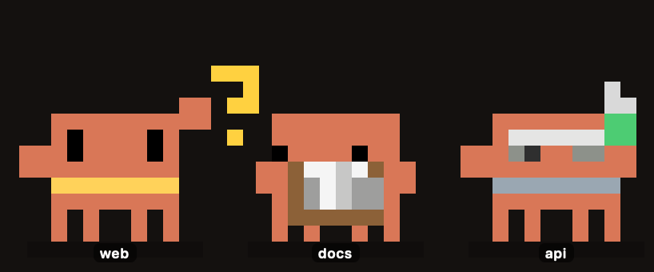
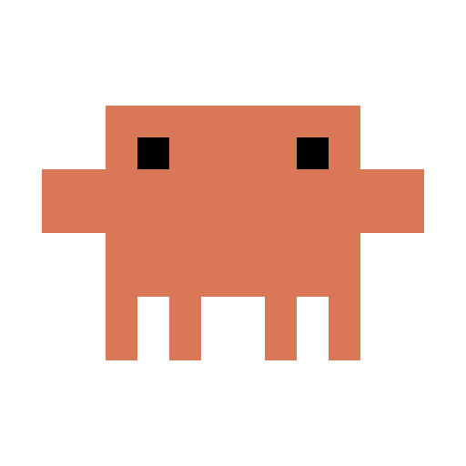
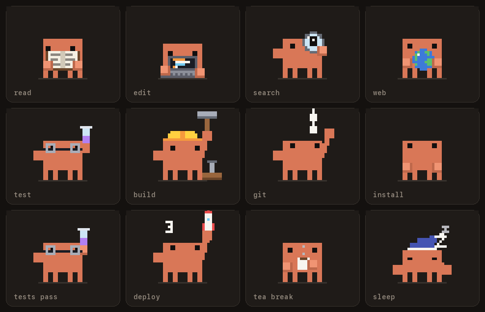
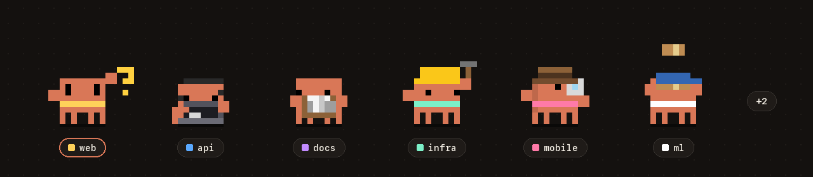
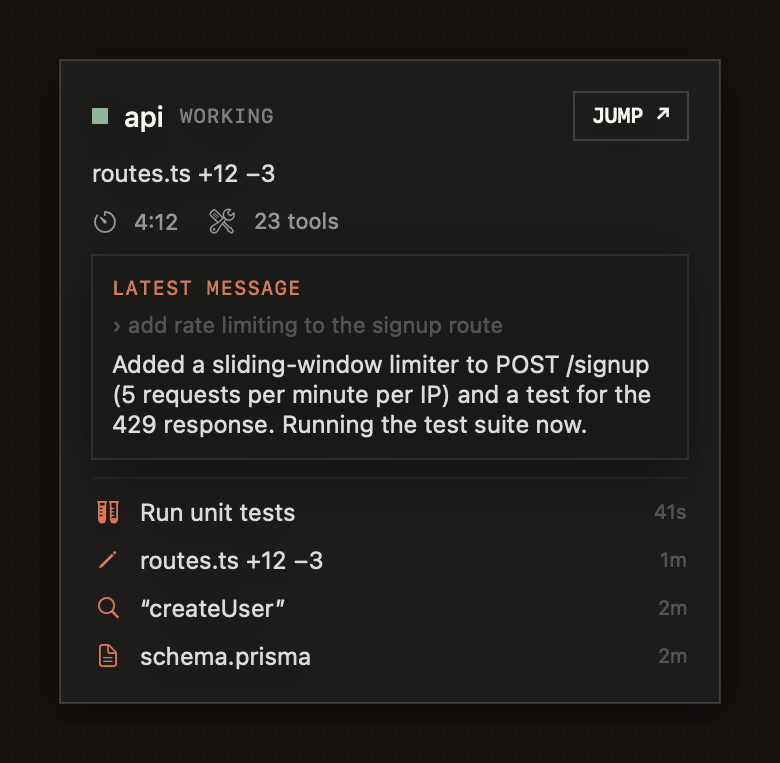
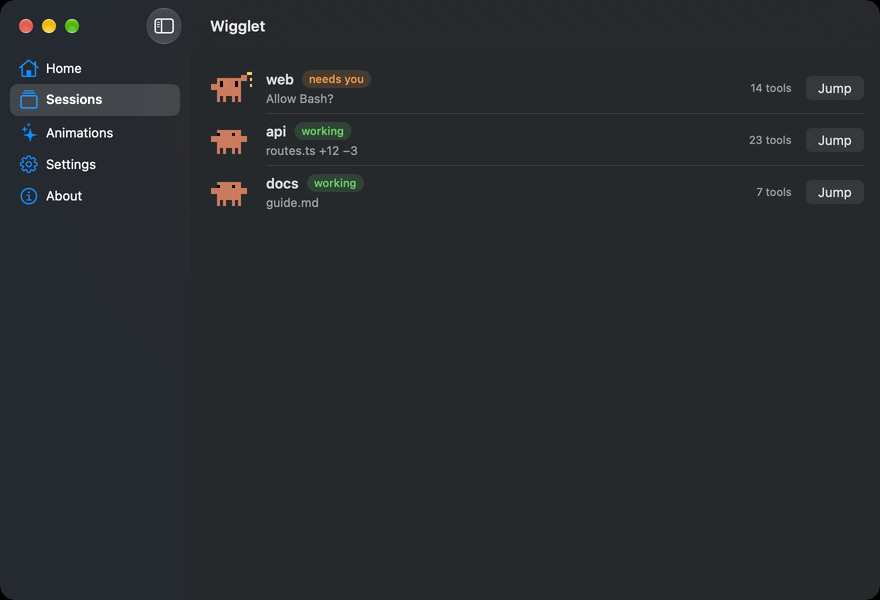
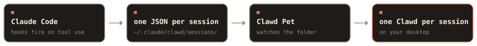

<p align="center">
  <picture>
    <source media="(prefers-color-scheme: dark)" srcset="docs/assets/hero-dark.gif">
    <source media="(prefers-color-scheme: light)" srcset="docs/assets/hero-light.gif">
    
  </picture>
</p>

<h1 align="center"><br>Wigglet</h1>

<p align="center"><b>One Wigglet for every Claude Code session.</b><br>A tiny pixel companion that floats on your Mac and shows what each session is doing.<br><a href="https://wigglet.vercel.app">wigglet.vercel.app</a></p>

<p align="center">
  
  
  
  
  
</p>

- **See every session at a glance.** Each Wigglet acts out what its session is doing. The one that needs you steps to the front.
- **Never miss an approval.** The menu-bar icon shows how many sessions are waiting on you.
- **Local by default.** Hooks write small JSON files on your disk. There are no accounts and no analytics.

## Install

> **First release lands today.** The download link appears here when `v1.0.0` is published. Until then, [build from source](#build-from-source).

1. Download `Wigglet.dmg` from Releases and drag **Wigglet** to Applications.
2. First launch only: right-click the app and choose **Open**, because it isn't notarized yet. Or run:
   ```sh
   xattr -dr com.apple.quarantine /Applications/Wigglet.app
   ```
3. Open Wigglet. The setup screen checks that it's in Applications, then click **Connect**. It adds Wigglet's hooks to `~/.claude/settings.json` (with a backup), shows a check mark, and waits until your first Claude Code session appears.

## Gallery

<picture>
  <source media="(prefers-color-scheme: dark)" srcset="docs/assets/gallery-dark.gif">
  <source media="(prefers-color-scheme: light)" srcset="docs/assets/gallery-light.gif">
  
</picture>

Every clip is listed in **[docs/ANIMATIONS.md](docs/ANIMATIONS.md)**, which is generated from the app's catalog.

<picture>
  <source media="(prefers-color-scheme: dark)" srcset="docs/assets/team-dark.gif">
  <source media="(prefers-color-scheme: light)" srcset="docs/assets/team-light.gif">
  
</picture>

## Features

| | |
|---|---|
| **A team of Wigglets** | One per session you're working in, including ones already open before you connected. Six side by side, then a `+N` badge, or switch to **One Wigglet** for all of them. Sessions you haven't touched for a while (30 min to a day, your pick) step aside. |
| **Live activity** | Each Wigglet shows what its session is doing: reading, editing, tests, builds, git, installs, web, sub-agents, plans or compaction. |
| **80+ pixel animations** | Hand-timed 12 fps frames: a deploy rocket, a tea break on long commands, a check mark when tests pass, high-fives and pass-the-parcel between sessions. |
| **Live hover card** | Hover over a Wigglet: project, turn timer, last actions and the session's latest message as it arrives. **Jump** takes you to that session's window. |
| **Chat with Claude** | Click a Wigglet or press <kbd>⌃⌥Space</kbd>. Uses your Claude Code login by default, or your own Anthropic, OpenAI, OpenRouter or Gemini key, or a local Ollama model. Keys live in the macOS Keychain. |
| **Private by default** | No accounts and no analytics. Nothing goes over the network unless you chat. |

<p align="center">
<br><sub>The hover card, rendered offscreen from the app's own view with a demo session.</sub></p>

## The app

<p align="center"></p>

Home walks you through setup with live checks. Sessions lists every session with a Jump button. Animations plays any clip. Settings holds the connection, size, sounds, launch at login and chat.

## How it works

<picture>
  <source media="(prefers-color-scheme: dark)" srcset="docs/assets/how-it-works-dark.svg">
  <source media="(prefers-color-scheme: light)" srcset="docs/assets/how-it-works-light.svg">
  
</picture>

Claude Code runs `Wigglet --hook` on session and tool events. The hook updates one small JSON file per session in `~/.claude/wigglet/sessions/`. The app watches that folder and picks an animation for each session. Details are in [docs/HOW_IT_WORKS.md](docs/HOW_IT_WORKS.md).

## Privacy

- **Stored:** tool names, file base names, the short description Claude writes for each command, the session's folder, which app it runs in (for Jump), and counters. Everything stays in `~/.claude/wigglet/sessions/`.
- **Shown, never stored:** the hover card reads the session's latest message from its local transcript to display it. It's never written to a file or sent anywhere. Turn it off in the menu.
- **Never stored:** file contents or full commands.
- **Network:** only for chat, and only to the provider you pick. The default runs your local `claude` CLI with no tools, so it can't read or change files.
- **Keys:** stored in the macOS Keychain (this Mac only), never in a file.

The full list is in [docs/PRIVACY.md](docs/PRIVACY.md).

<details>
<summary><b>Build from source</b></summary>

Requires macOS 13+ and the Xcode command line tools.

```sh
cd app && ./build.sh          # universal Wigglet.app (arm64 + x86_64)
./package.sh                  # also writes Wigglet.zip and Wigglet.dmg
```

Checks, run from the repo root with a throwaway `HOME`:

```sh
HOME=/tmp/wigglet-test app/Wigglet.app/Contents/MacOS/Wigglet --selftest
HOME=/tmp/wigglet-test app/Wigglet.app/Contents/MacOS/Wigglet --pixel-audit
HOME=/tmp/wigglet-test app/Wigglet.app/Contents/MacOS/Wigglet --frame-audit
```
</details>

<details>
<summary><b>Uninstall</b></summary>

1. In Wigglet's **Settings**, click **Disconnect** (or use **Disconnect and remove hooks** in the menu-bar icon). Only Wigglet's hooks are removed.
2. Quit Wigglet and drag it to the Trash.
3. Optional cleanup:
   ```sh
   rm -rf ~/.claude/wigglet
   for p in anthropic openai openrouter gemini; do security delete-generic-password -s dev.wigglet.app -a $p; done   # keys, if you added any
   defaults delete dev.wigglet.app
   ```

If you've already deleted the app, remove the hooks first with `Wigglet.app/Contents/MacOS/Wigglet --remove-hooks`, or delete the entries that contain `Wigglet --hook` from `~/.claude/settings.json`.
</details>

<details>
<summary><b>FAQ</b></summary>

**Does it use my Claude usage?**
The animations never do, because they come from local files. Chat uses **Claude Code** by default, which runs `claude -p` and counts toward your plan (with tools off, so each message is small). To keep chat off your plan, pick Anthropic, OpenAI, OpenRouter or Gemini with your own key, or a local Ollama model, in **Settings → Chat**.

**Does it work with the Claude desktop app?**
Yes. Sessions in the desktop app's Code tab run the same hooks as the terminal, so they get a Wigglet too. Plain chats in the Claude app aren't Claude Code sessions, so they don't.

**Does it work with several sessions?**
Yes, that's what it's for. Each session gets its own Wigglet, name tag and scarf colour.

**Is it safe to connect?**
Connect adds hook entries that call the app with `--hook`, after saving a backup to `~/.claude/settings.json.wigglet-backup`. If your `settings.json` isn't valid JSON, it leaves the file alone. The hook only writes metadata, and the source is here if you want to check.

**Can it jump to the right window?**
Terminal: the exact tab (macOS asks once for permission). iTerm2 uses the same approach, and VS Code and Cursor open the session's folder in that editor, but those three are untested so far. Claude desktop app: Jump opens that session with the same `claude://resume` link Claude Code's `/desktop` command uses (not tested live yet). Anything else: the app comes forward and a note says it couldn't pick the session.

**How do I disconnect?**
Click **Disconnect** in Settings, or use the menu-bar icon. Hooks you added yourself stay.
</details>

<details>
<summary><b>Troubleshooting</b></summary>

- **"Wigglet can't be opened."** Right-click the app and choose **Open**, or run the `xattr` line above.
- **No Wigglet appears for a session.** Open Wigglet: Home shows each setup step with a check mark. If step 1 warns, move Wigglet into Applications and open it from there (macOS runs apps from Downloads in a temporary place that Claude Code can't reach). Then start a new session. Sessions that were already running show up after their next tool call.
- **Connect fails.** Your `~/.claude/settings.json` probably isn't valid JSON. Fix it, then connect again.
</details>

---

<sub>Unofficial fan project. Not affiliated with or endorsed by Anthropic. "Claude" and the pixel mascot design (Clawd) belong to Anthropic; Wigglet is the name of this app. Source available. All rights reserved until a license is announced.</sub>
