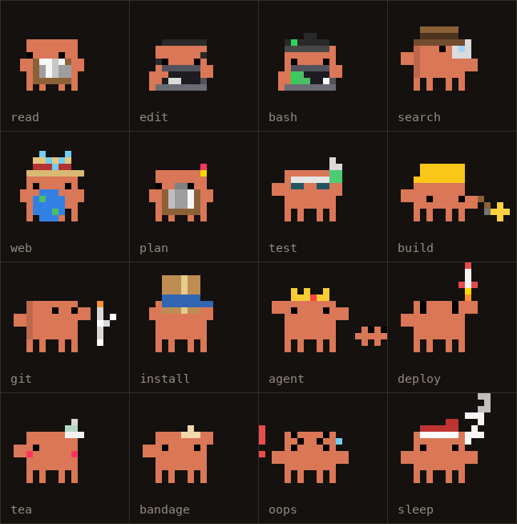
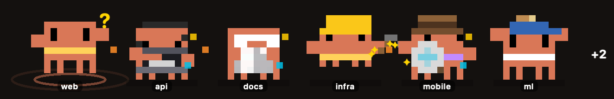

<p align="center">
  <picture>
    <source media="(prefers-color-scheme: dark)" srcset="docs/assets/hero-dark.gif">
    <source media="(prefers-color-scheme: light)" srcset="docs/assets/hero-light.gif">
    
  </picture>
</p>

<h1 align="center">Clawd Pet</h1>

<p align="center"><b>One Clawd for every Claude Code session.</b><br>A tiny pixel companion that floats on your Mac and shows what each session is doing.</p>

<p align="center">
  
  
  
  
  
</p>

- **See every session at a glance.** Each Clawd acts out what its session is doing. The one that needs you steps to the front.
- **Never miss an approval.** The menu-bar icon shows how many sessions are waiting on you.
- **Local by default.** Hooks write small JSON files on your disk. There are no accounts and no analytics.

## Install

> **First release lands today.** The download link appears here when `v1.0.0` is published. Until then, [build from source](#build-from-source).

1. Download `ClawdPet.dmg` from Releases and drag **Clawd Pet** to Applications.
2. First launch only: right-click the app and choose **Open**, because it isn't notarized yet. Or run:
   ```sh
   xattr -dr com.apple.quarantine /Applications/ClawdPet.app
   ```
3. Click **Connect** when it asks. That adds Clawd Pet's hooks to `~/.claude/settings.json` and saves a backup first. Start a new Claude Code session and its Clawd appears.

## Gallery

<picture>
  <source media="(prefers-color-scheme: dark)" srcset="docs/assets/gallery-dark.png">
  <source media="(prefers-color-scheme: light)" srcset="docs/assets/gallery-light.png">
  
</picture>

Every clip is listed in **[docs/ANIMATIONS.md](docs/ANIMATIONS.md)**, which is generated from the app's catalog.

<picture>
  <source media="(prefers-color-scheme: dark)" srcset="docs/assets/team-dark.png">
  <source media="(prefers-color-scheme: light)" srcset="docs/assets/team-light.png">
  
</picture>

## Features

| | |
|---|---|
| **A team of Clawds** | One per running session, six side by side, then a `+N` badge. Waiting sessions move to the front. |
| **Live activity** | Each Clawd shows what its session is doing: reading, editing, tests, builds, git, installs, web, sub-agents, plans or compaction. |
| **80+ pixel animations** | A deploy rocket, a tea break on long commands, a bandage after three failures, and high-fives and pass-the-parcel between sessions. |
| **Hover card** | Hover over a Clawd to see its project, turn timer, tool count and last few actions. |
| **Chat on your OpenRouter key** | Click a Clawd or press <kbd>⌃⌥Space</kbd>. Your key is stored in the macOS Keychain. |
| **Private by default** | No accounts and no analytics. Nothing goes over the network unless you chat. |

## How it works

<picture>
  <source media="(prefers-color-scheme: dark)" srcset="docs/assets/how-it-works-dark.svg">
  <source media="(prefers-color-scheme: light)" srcset="docs/assets/how-it-works-light.svg">
  
</picture>

Claude Code runs `ClawdPet --hook` on session and tool events. The hook updates one small JSON file per session in `~/.claude/clawd/sessions/`. The app watches that folder and picks an animation for each session. Details are in [docs/HOW_IT_WORKS.md](docs/HOW_IT_WORKS.md).

## Privacy

- **Stored:** tool names, file base names, the short description Claude writes for each command, the session's folder, and counters. Everything stays in `~/.claude/clawd/sessions/`.
- **Never stored:** file contents or full commands.
- **Network:** only for chat. Without an OpenRouter key, chat runs your local `claude` CLI instead.
- **Key:** stored in the macOS Keychain, never in a file.

The full list is in [docs/PRIVACY.md](docs/PRIVACY.md).

<details>
<summary><b>Build from source</b></summary>

Requires macOS 13+ and the Xcode command line tools.

```sh
cd app && ./build.sh          # universal ClawdPet.app (arm64 + x86_64)
./package.sh                  # also writes ClawdPet.zip and ClawdPet.dmg
```

Checks, run from the repo root with a throwaway `HOME`:

```sh
HOME=$(mktemp -d) app/ClawdPet.app/Contents/MacOS/ClawdPet --selftest
HOME=$(mktemp -d) app/ClawdPet.app/Contents/MacOS/ClawdPet --pixel-audit
```
</details>

<details>
<summary><b>Uninstall</b></summary>

1. Choose **Disconnect and remove hooks** from the menu-bar icon. Only Clawd Pet's hooks are removed.
2. Quit Clawd Pet and drag it to the Trash.
3. Optional cleanup:
   ```sh
   rm -rf ~/.claude/clawd
   security delete-generic-password -s dev.clawdpet.app -a openrouter   # only if you added a key
   defaults delete dev.clawdpet.app
   ```

If you've already deleted the app, remove the hooks first with `ClawdPet.app/Contents/MacOS/ClawdPet --remove-hooks`, or delete the entries that contain `ClawdPet --hook` from `~/.claude/settings.json`.
</details>

<details>
<summary><b>FAQ</b></summary>

**Does it use my Claude usage?**
The animations never do, because they come from local hook files. Chat with an OpenRouter key doesn't either. Without a key, or with **Use Claude Code CLI instead** checked in AI settings, chat runs `claude -p`, and that does count toward your plan.

**Does it work with several sessions?**
Yes, that's what it's for. Each session gets its own Clawd, name tag and scarf colour.

**Is it safe to connect?**
Connect adds hook entries that call the app with `--hook`, after saving a backup to `~/.claude/settings.json.clawd-backup`. If your `settings.json` isn't valid JSON, it leaves the file alone. The hook only writes metadata, and the source is here if you want to check.

**How do I disconnect?**
Choose **Disconnect and remove hooks** from the menu-bar icon. Hooks you added yourself stay.
</details>

<details>
<summary><b>Troubleshooting</b></summary>

- **"Clawd Pet can't be opened."** Right-click the app and choose **Open**, or run the `xattr` line above.
- **No Clawd appears for a session.** Check that the menu-bar icon says **Connected to Claude Code**, then start a new session. Sessions that were already running show up after their next tool call.
- **Connect fails.** Your `~/.claude/settings.json` probably isn't valid JSON. Fix it, then connect again.
</details>

---

<sub>Unofficial fan project. Not affiliated with or endorsed by Anthropic. "Claude" and the Clawd mascot belong to Anthropic. Source available. All rights reserved until a license is announced.</sub>
